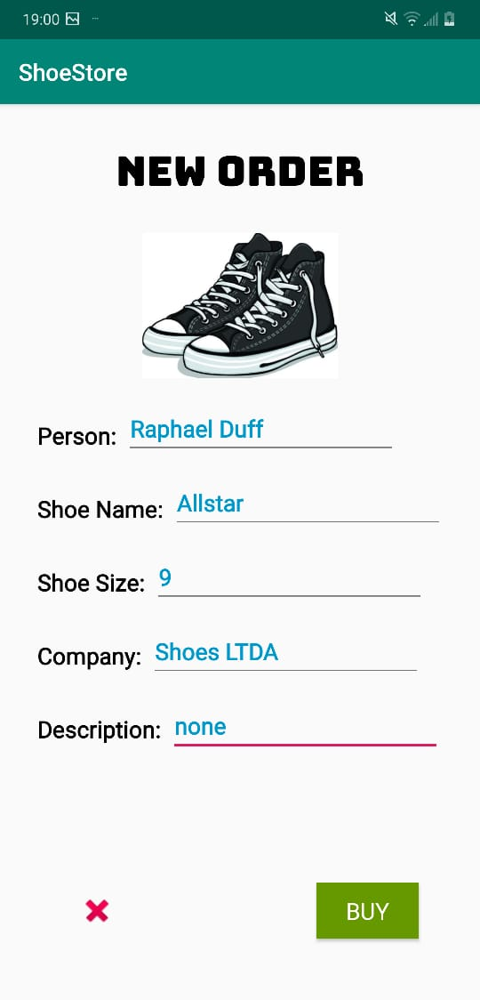

# Capstone - ShoeStore App - Layout, Navigation and Livedata!
1st Capstone of the Android App Development in Kotlin course on Udacity.

## Shoe Store!

This store was created for Customer Designers to buy and organize the shoes used in movie productions.

## Screenshots

     

